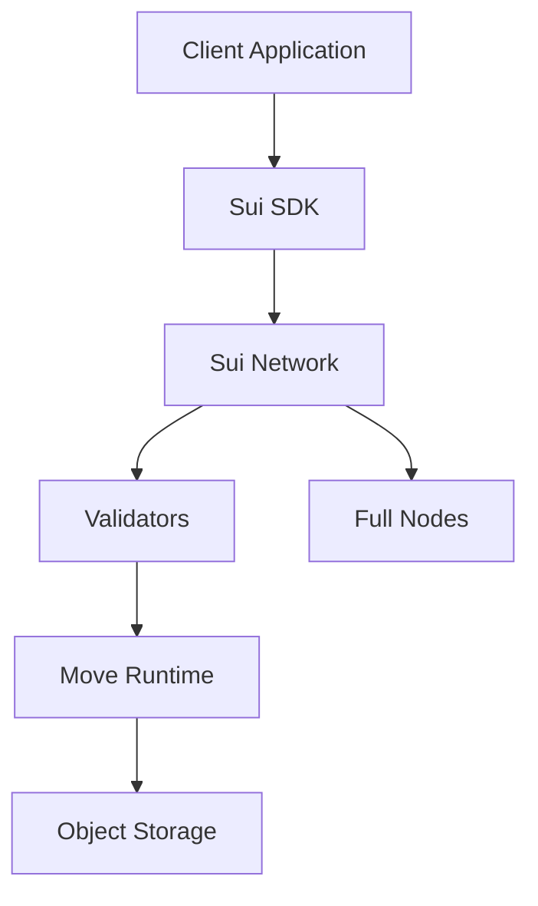

# Chào mừng đến với Sui Move

## 1. Sui là gì?

**Sui** là một blockchain layer-1 được phát triển bởi Mysten Labs, được thiết kế để cung cấp:

- **Hiệu suất cao**: Parallel execution cho throughput lớn
- **Độ trễ thấp**: Finality nhanh chóng
- **Chi phí thấp**: Gas fees hợp lý
- **Developer-friendly**: Công cụ và ngôn ngữ dễ sử dụng

## 2. Move là gì?

**Move** là ngôn ngữ lập trình được thiết kế đặc biệt cho blockchain:

### 2.1. Đặc điểm chính
- **Resource-oriented**: Tài nguyên không thể copy hay drop tùy ý
- **Safety-first**: Ngăn chặn các lỗi phổ biến trong smart contracts
- **Formal verification**: Có thể chứng minh tính đúng đắn của code

### 2.2. Tại sao chọn Move?
```move
// Move ngăn chặn double-spending tự động
public fun transfer_coin(coin: Coin, recipient: address) {
    transfer::public_transfer(coin, recipient);
    // coin đã được "moved", không thể sử dụng lại
}
```

## 3. Sui Move vs Move gốc

| Đặc điểm           | Move gốc (Diem) | Sui Move             |
| ------------------ | --------------- | -------------------- |
| Object Model       | Global Storage  | Object-centric       |
| Parallel Execution | Không           | Có                   |
| Gas Model          | Account-based   | Object-based         |
| Entry Functions    | Có              | Có, với improvements |

## 4. Kiến trúc của Sui



## 5. Ecosystem và Tools

### 5.1. Development Tools
- **Sui CLI**: Command line interface
- **Move Analyzer**: IDE extension
- **Sui Explorer**: Block explorer
- **Sui Wallet**: Browser wallet

### 5.2. Programming Libraries
- **Sui Framework**: Core libraries
- **Move Standard Library**: Basic utilities
- **Third-party packages**: Community contributions

## 6. Roadmap học tập

### Bước 1: Cơ bản 🌱
1. Cài đặt môi trường development
2. Hiểu về objects và ownership
3. Viết module Move đầu tiên
4. Học về data types và functions

### Bước 2: Trung cấp 🌿
1. Struct và abilities
2. Object model và UID
3. Dynamic fields
4. Error handling

### Bước 3: Nâng cao 🌳
1. Capability patterns
2. One-time witness
3. Upgradeability
4. Testing và deployment

### Bước 4: Thực hành 🚀
1. Build NFT collection
2. DeFi protocols
3. Gaming applications
4. DAO governance

## 7. Community và Resources

- **Discord**: [Sui Developer Community](https://discord.gg/sui)
- **GitHub**: [Sui Repository](https://github.com/MystenLabs/sui)
- **Docs**: [Official Documentation](https://docs.sui.io)
- **Examples**: [Move Examples](https://github.com/MystenLabs/sui/tree/main/examples)

## 8. Bắt đầu ngay!

Sẵn sàng để bắt đầu hành trình với Sui Move? Hãy chuyển sang phần tiếp theo để cài đặt môi trường development và viết chương trình đầu tiên!

```bash
# Cài đặt Sui CLI
curl -fLJO https://github.com/MystenLabs/sui/releases/download/testnet-v1.14.0/sui-testnet-v1.14.0-macos-x86_64.tgz

# Tạo project đầu tiên
sui move new my_first_project
```

Chúc bạn học tập vui vẻ! 🎉 